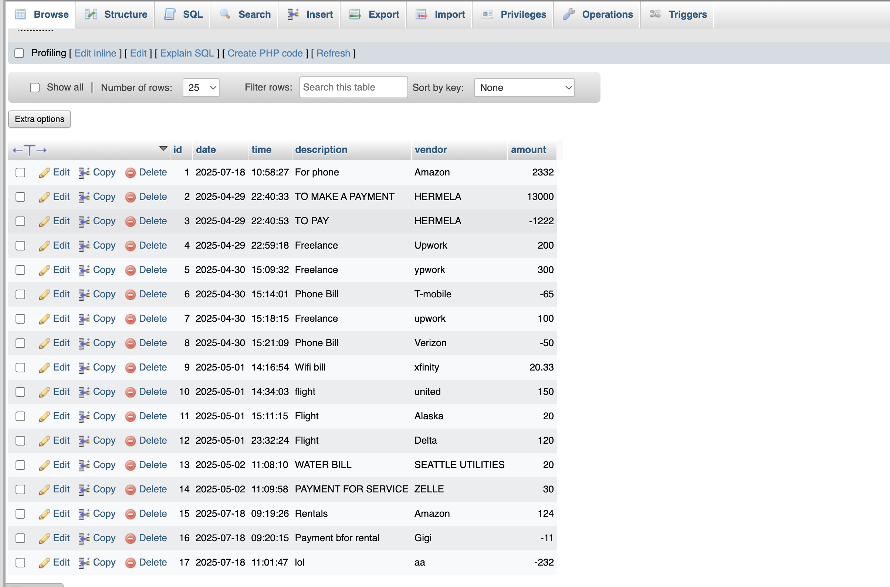
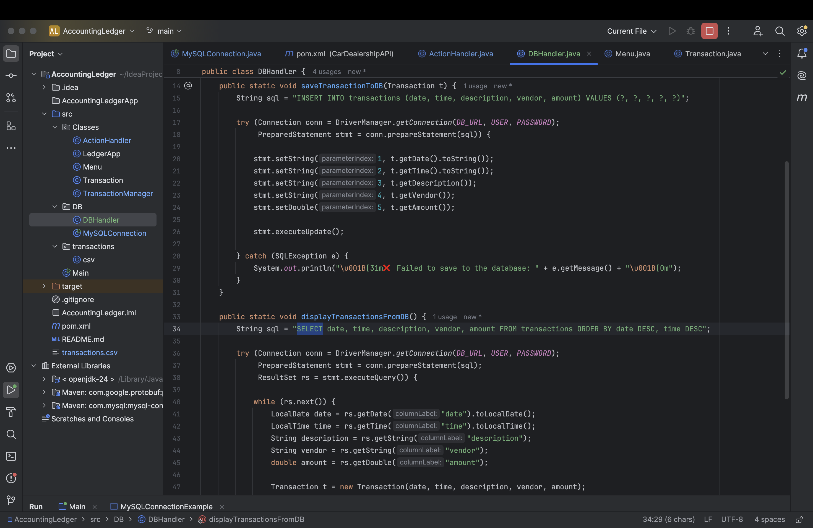

# 📘 Accounting Ledger App (Java CLI)

Welcome to the **Accounting Ledger App** — a Java-based Command Line Interface (CLI) that helps users track financial transactions like deposits, payments, and generate custom reports. Data is stored persistently in a `transactions.csv` file.

This project was built as my **Capstone 1** for the *Java Development Fundamentals* module at **YearUp**. It demonstrates clean OOP design, real-world financial logic, and a user-friendly CLI experience.

---

## 🚀 New Features We Added

1. ✨ Enhanced UI with colors and emojis  
2. 📊 Total income, expenses, and net balance display  
3. 🛡️ Safe error handling using try-catch blocks  
4. 🔍 Custom search by fields  
5. 📁 Organized code using a proper package structure  
6. 🗃️ Created and connected a database for persistent storage  

---

## 🎯 Project Goals (per Capstone Spec)

- Add deposits & payments  
- Display ledger: All / Deposits / Payments  
- Run reports:  
  - Month-to-Date  
  - Previous Month  
  - Year-to-Date  
  - Previous Year  
  - Search by Vendor  
  - Custom search by date, description, vendor, amount  
- Input validation (no crashing on bad input)  
- Stores data in `transactions.csv`  
- Uses `Scanner`, `BufferedReader/Writer`, `ArrayList`, `LocalDate/Time`  

---

## 🌟 Features & Highlights

- 🎛️ CLI menu with emojis and ANSI-colored text  
- 💰 Add deposits & make payments — cleanly saved  
- 📄 View ledger, sorted with most recent first  
- 📉 Built-in reports with real-time filters  
- 🔍 Custom search (mix and match fields)  
- 📊 Summary stats: income, expenses, and net balance  
- 🚫 Smart error handling — app doesn’t crash on bad input  

---

## 🖼️ Screenshots

### 🏠 Main Menu  


### 💰 Deposit Form  


### 📉 Reports Screen  


### 🔍 Custom Search Prompt  


### 📊 Ledger Output + Net Balance Summary  


### 📊 My sql Database  


### 📊 My sql Database Query for Displaying Transactions

---

## 💡 Interesting Code Snippet

Safe numeric input with a retry prompt:
```java
public static double getValidAmount(Scanner sc) {
    while (true) {
        String input = sc.nextLine();
        try {
            return Double.parseDouble(input);
        } catch (NumberFormatException e) {
            System.out.print("\u001B[31m❌ Invalid number. Try something like 125.50 💡\u001B[0m\n💵 Enter amount again: ");
        }
    }
}
